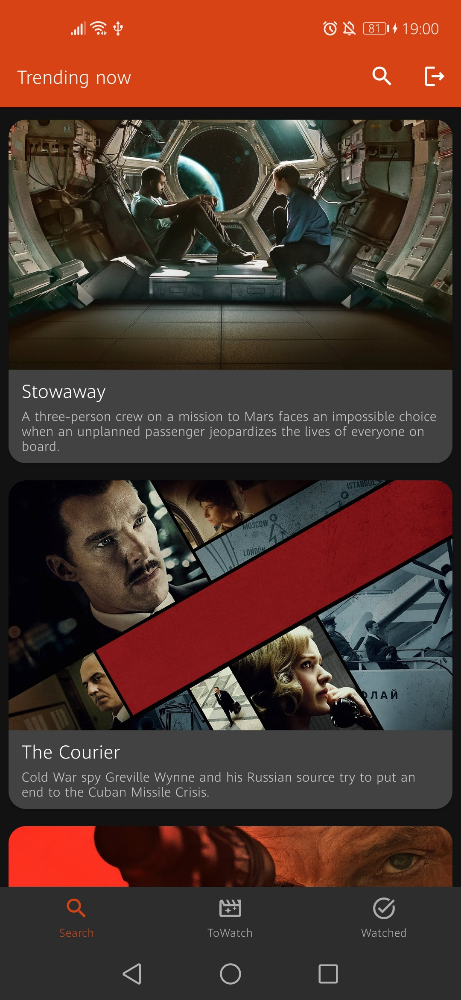
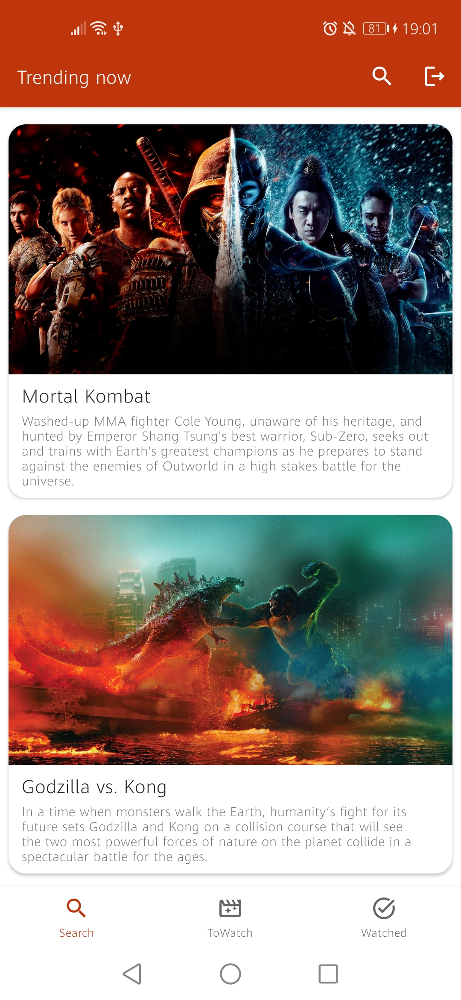
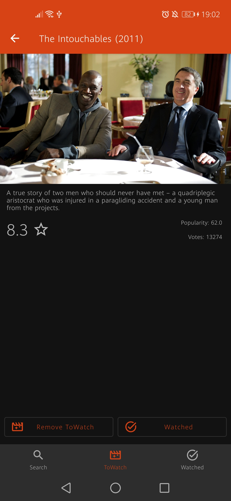
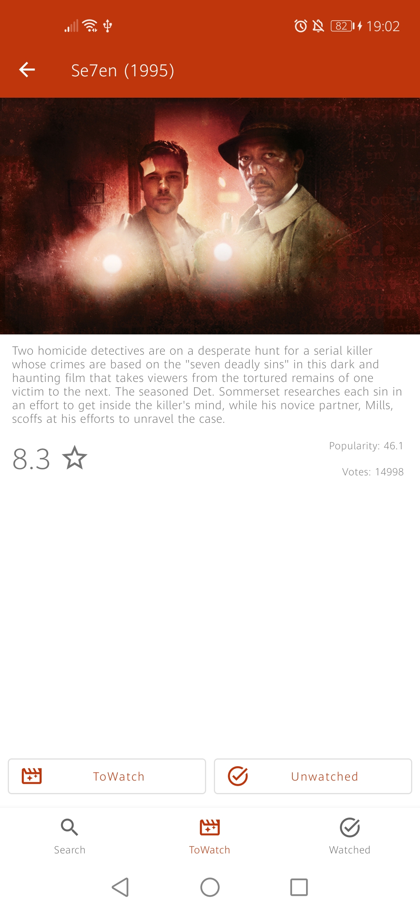
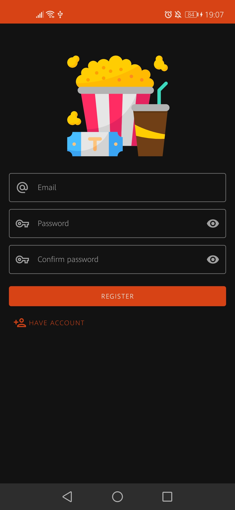
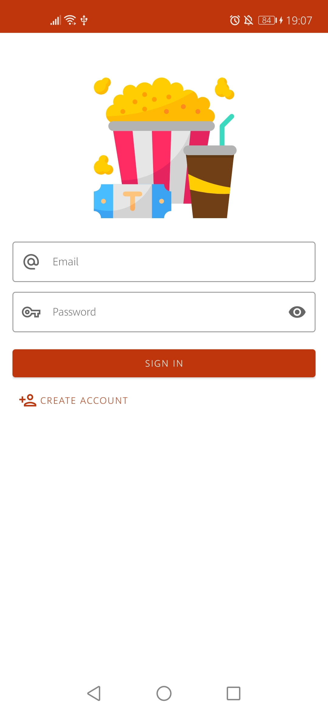
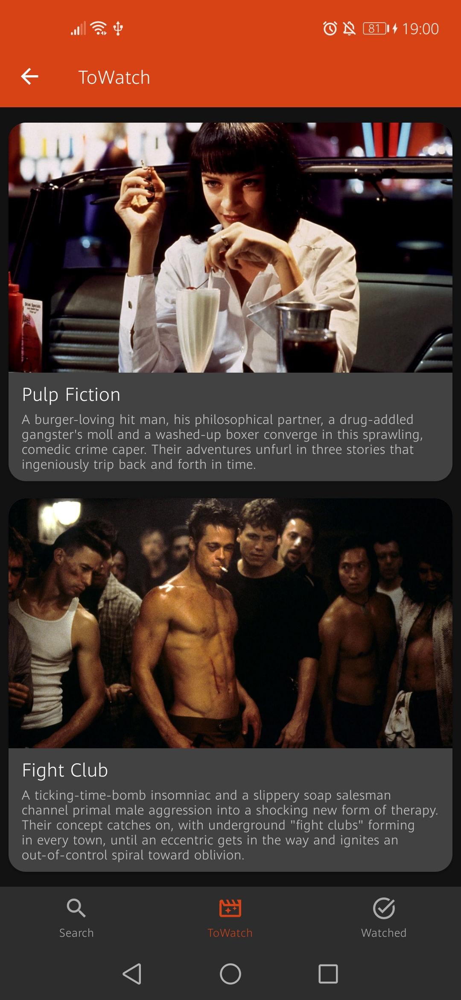
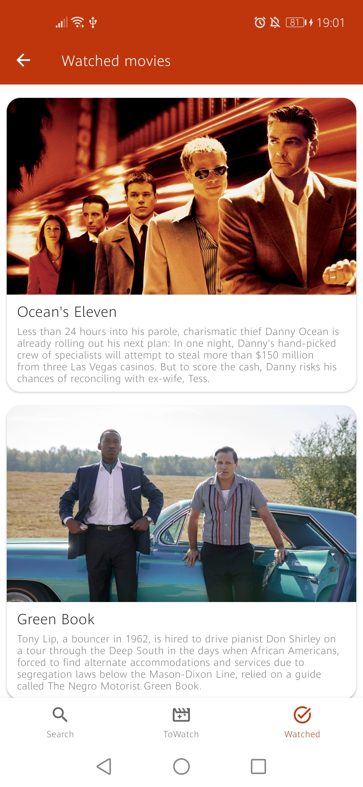

# ToWatch
An app that allows searching movies from TMDB API and adding them to Firebase Realtime DB for logged users. 

### Home screen with trending movies in last week:

</img>
</img>

### Movie detailed screen:

</img>
</img>

### Login/Registration screen:

</img>
</img>

### Watched/ToWatch movies:

</img>
</img>
